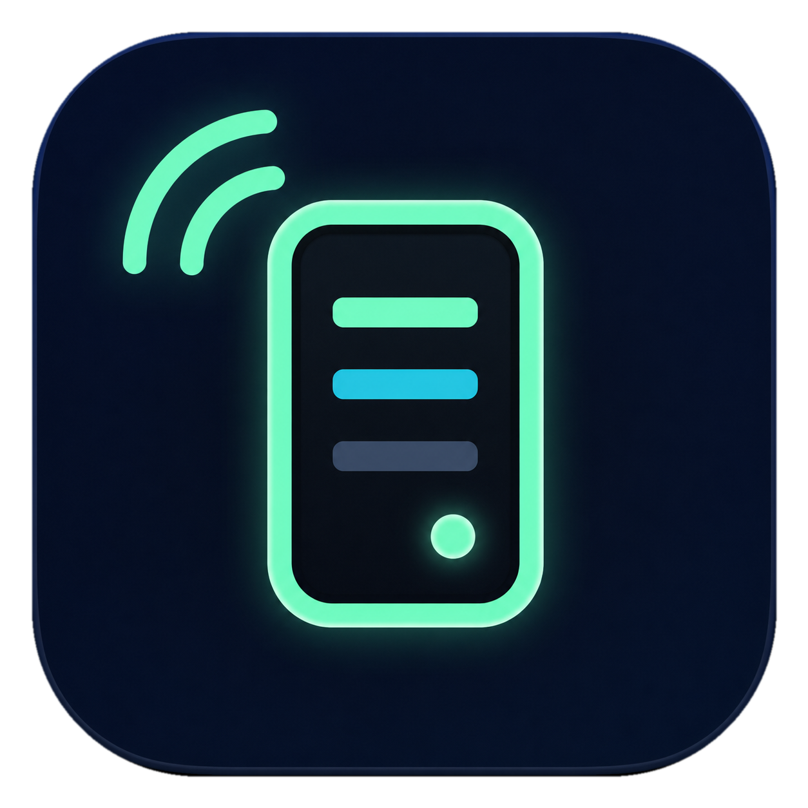

# Codex 屏显 for Linx68

把 Codex 用量、番茄钟、CPU/内存/网络状态或自定义图片渲染为 `142 × 428` JPEG，并通过局域网推送到 Linx68 键盘左侧屏幕。

<p align="center">
  
</p>

## 平台状态

| 平台 | 新版 Avalonia 应用 | 系统监控 | 登录时启动 | 系统托盘 |
| --- | --- | --- | --- | --- |
| Windows x64 | 支持 | 支持 | 支持 | 支持 |
| macOS Apple Silicon / Intel | 支持 | 支持 | 支持 | 支持 |
| Linux x64 | 预览支持 | 支持 | 支持 | 取决于桌面环境的 AppIndicator/StatusNotifier 支持 |

跨平台版位于 `src/CodexLinxDisplay.Desktop`，使用 .NET 10、Avalonia 12.1 和 SkiaSharp。原 WinForms 稳定版仍保留在 `src/CodexLinxDisplay.Windows`，现有 v0.4.x 用户不会受迁移影响。

## 功能

- Codex 用量：显示当前周期剩余、重置次数、重置时间和电脑本地时间。
- 番茄钟：任务名称、专注/短休/长休时长，支持暂停、继续、跳过和重置。
- 系统监控：CPU、内存、下载/上传速度与系统运行时间。
- 自定义图片：自动居中裁切，并为键盘状态栏保留 44–80px 顶部安全区。
- 四套共享主题：深空薄荷、明亮极简、霓虹紫、琥珀终端。
- 动态预览与定时推送，图片始终为 `142 × 428` JPEG 且不超过 512KB。
- Windows/macOS 关闭窗口后可继续在系统托盘运行；三平台均可配置登录时启动。
- 首次运行跨平台版时会自动迁移旧 Windows 版的 API 地址、主题、模式和图片设置。

## 下载

- Windows v0.4 稳定版继续从 [GitHub Releases](https://github.com/NCZkevin/LinxDisplayWindows/releases/latest) 下载。
- v0.5 跨平台预览版发布后，同一 Releases 页面会提供 Windows、macOS Apple Silicon、macOS Intel 和 Linux 文件。
- 普通桌面软件应放在 GitHub Releases，而不是 Packages；Packages 主要用于 NuGet、容器等供其他软件依赖的制品。

预览版采用自包含发布，无需预装 .NET。macOS 预览包暂未使用 Apple Developer ID 签名，首次打开可能需要在“系统设置 → 隐私与安全性”中手动允许。

### macOS 安装

1. 在“关于本机”确认芯片类型：M1/M2/M3/M4/M5 选择 `AppleSilicon`，Intel 处理器选择 `Intel`。
2. 下载对应的 `.zip` 并解压，得到 `CodexLinxDisplay.app`。
3. 将 `.app` 拖入“应用程序”后打开。当前预览版尚未使用 Apple Developer ID 公证；若系统拦截，请按住 Control 点击应用并选择“打开”，或在“系统设置 → 隐私与安全性”中允许。

发布目录中那个没有后缀的 `CodexLinxDisplay` 是 `.app/Contents/MacOS` 内部的 Unix 可执行文件，不是给用户直接双击的安装成品。GitHub Actions 会组装、临时签名并校验完整 `.app`，再用 macOS 原生方式压缩成 `.zip`，以保留可执行权限和应用包结构。

## 与旧版的功能对照

| 功能 | WinForms 稳定版 | Avalonia 跨平台版 |
| --- | --- | --- |
| Codex 用量、刷新周期、定时/分钟变化推送 | 支持 | 支持 |
| 番茄钟及实时状态、操作后立即推送 | 支持 | 支持 |
| CPU/内存/网络监控及动态推送周期 | 支持 | 支持，并允许 2–60 秒自定义 |
| 自定义图片（含 GIF 首帧） | 支持 | 支持 |
| 四套卡片样式、安全区、JPEG 质量 | 支持 | 支持 |
| 系统托盘打开、立即推送、退出 | 支持 | 支持 |
| 登录时自动启动、旧设置迁移 | Windows | Windows / macOS / Linux |

跨平台版在切换显示模式以及开始、暂停、跳过或重置番茄钟后，会像旧版一样立即向键盘推送当前画面。

## 从源码运行

安装 [.NET 10 SDK](https://dotnet.microsoft.com/download/dotnet/10.0) 后执行：

```powershell
dotnet restore CodexLinxDisplay.CrossPlatform.slnx
dotnet run --project src/CodexLinxDisplay.Desktop/CodexLinxDisplay.Desktop.csproj
```

在“图像 API”中填写键盘当前地址，例如：

```text
http://192.168.31.71/image/upload
```

程序会以 `Content-Type: image/jpeg` 发送原始 JPEG 请求体。电脑与键盘需要连接在同一局域网。

Codex 用量读取依赖本机 Codex CLI。程序会先读取 `CODEX_CLI_PATH`，再从 `PATH` 查找 `codex`（Windows 也支持 `codex.exe`、`.cmd`、`.bat`）。例如：

```powershell
[Environment]::SetEnvironmentVariable("CODEX_CLI_PATH", "C:\path\to\codex.exe", "User")
```

macOS/Linux 可在 shell 配置中设置：

```bash
export CODEX_CLI_PATH=/path/to/codex
```

## 验证

跨平台冒烟测试覆盖四套主题的 Codex、番茄钟、系统监控卡片，JPEG 编解码、番茄钟状态切换以及当前系统的 CPU/内存采样：

```powershell
dotnet run --project tests/CodexLinxDisplay.CrossPlatform.Tests --configuration Release
```

GitHub Actions 会在 Windows、macOS 和 Ubuntu 上分别构建并运行同一套测试。推送与桌面项目版本一致的 `vX.Y.Z-preview.N` 标签时，会创建预发布 Release：

- `CodexLinxDisplay-Windows-x64-*.zip`
- `CodexLinxDisplay-macOS-AppleSilicon-*.zip`
- `CodexLinxDisplay-macOS-Intel-*.zip`
- `CodexLinxDisplay-Linux-x64-*.tar.gz`
- `SHA256SUMS.txt`

正式 `vX.Y.Z` 标签暂时继续走原 Windows 稳定版发布流程，直到跨平台版完成足够的实机验证。

## 本地数据与隐私

配置、番茄钟状态和自定义图片副本保存在系统的用户应用数据目录：

- Windows：`%APPDATA%\CodexLinxDisplay`
- macOS：`~/Library/Application Support/CodexLinxDisplay`
- Linux：`~/.config/CodexLinxDisplay`（受 `XDG_CONFIG_HOME` 影响）

程序不会上传 Codex 凭据或原始用量/系统监控数据；只有渲染后的 JPEG 会发送到用户填写的键盘地址。登录时启动分别使用 Windows 当前用户 Run 注册表项、macOS LaunchAgent 和 Linux XDG Autostart 文件。

## 项目结构

- `src/CodexLinxDisplay.Core`：设置、Codex 协议、番茄钟、上传和三平台系统服务。
- `src/CodexLinxDisplay.Rendering`：基于 SkiaSharp 的 `142 × 428` JPEG 渲染器。
- `src/CodexLinxDisplay.Desktop`：Avalonia 跨平台桌面界面与系统托盘。
- `tests/CodexLinxDisplay.CrossPlatform.Tests`：三平台共用冒烟测试。
- `src/CodexLinxDisplay.Windows`：保留的 WinForms 稳定版。
- `.github/workflows/cross-platform-ci.yml`：Windows/macOS/Linux 持续集成。
- `.github/workflows/cross-platform-preview.yml`：跨平台预览版发布。

## 旧 Windows 稳定版

需要构建 v0.4.x WinForms 版本时仍可执行：

```powershell
.\scripts\build.ps1
```

它继续输出到 `artifacts/windows-x64`，旧冒烟测试位于 `tests/CodexLinxDisplay.Windows.SmokeTests`。
